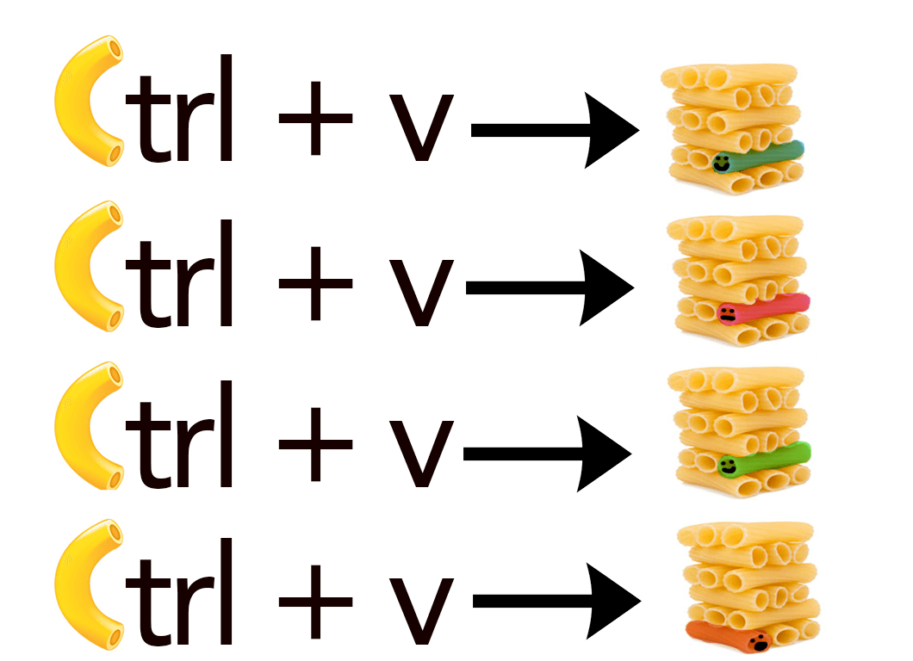

---
jupytext:
  text_representation:
    extension: .md
    format_name: myst
    format_version: 0.13
    jupytext_version: 1.16.4
kernelspec:
  display_name: Python 3 (ipykernel)
  language: python
  name: python3
---

+++ {"editable": true, "slideshow": {"slide_type": "slide"}}

# Clean, Modular Code: overview

+++ {"editable": true, "slideshow": {"slide_type": ""}}

## Part 1: 3 strategies

* Use [consistent code format](pep8-code-format)
* Use [expressive object names](python-expressive-code)
* [Make your code DRY](dry-code)

+++ {"editable": true, "slideshow": {"slide_type": "slide"}, "jp-MarkdownHeadingCollapsed": true}

### PEP 8 & consistent code format

* Generally accepted rules for code format: PEP 8
* Set of rules around white space, naming conventions, import orders and more.
* Code Formatters: Tools to apply PEP 8 as you work!

+++ {"editable": true, "slideshow": {"slide_type": "skip"}}

## Notes

```{code-cell} ipython3
---
editable: true
jupyter:
  source_hidden: true
slideshow:
  slide_type: ''
---
# this code is not PEP8 compliant -- why?
def doStuff(a ,b):print ("Result:",a+b) ; return a+b
x=True
if x: print ( "Messy code.") ; print("Oops!")
```

```{code-cell} ipython3
---
editable: true
slideshow:
  slide_type: ''
---
# This code is PEP8 compliant -- why?
def do_stuff(number1, number2):
    print("Result:", number1 + number2)
    return number1 + number2


x = True
if x:
    print("This is nicer code.")
    print("Yay!")
```

+++ {"editable": true, "slideshow": {"slide_type": "slide"}}

### (A few) Code format tools

* Jupyter code formatter (installed in this binder).
* Black
* Ruff

+++ {"editable": true, "slideshow": {"slide_type": "slide"}, "jp-MarkdownHeadingCollapsed": true}

#### [Other tools to consider](tools-code-style)

* `pre-commit` hooks: use with .git; apply every time you commit changes
* Setup VSCode (and other IDE's) to format on save

+++ {"editable": true, "slideshow": {"slide_type": "slide"}}

## Expressive code

* Code can become documentation when written well.
* Use variable, function & class names that tell a user what each thing does

+++ {"editable": true, "slideshow": {"slide_type": "slide"}}

:::{figure} /images/clean-code/clean-code-expressive-variable-names-basmati-rice.png
:alt: "Image showing a large see-through Tupperware container with cookies in it but a label that says Basmati Rice."

A large see-through Tupperware container labeled "Basmati Rice" containing cookies.
:::

```{code-cell} ipython3
---
editable: true
slideshow:
  slide_type: slide
---
# Could this code be more clear?
def do_stuff(a, b):
    print("Result:", a + b)
    return a + b


x = True
if x:
    print("This is less nice code.")
```

```{code-cell} ipython3
---
editable: true
slideshow:
  slide_type: ''
---
def calculate_sum(number1, number2):
    print("Result:", number1 + number2)
    return number1 + number2


is_valid = True
if is_valid:
    print("This is nicer code.")
    print("Yay!")
```

+++ {"editable": true, "slideshow": {"slide_type": "slide"}}

## DRY code

* Don't Repeat Yourself
* Use functions, loops and conditionals instead

+++ {"editable": true, "slideshow": {"slide_type": "slide"}}

<center></center>

```{code-cell} ipython3
---
editable: true
slideshow:
  slide_type: slide
---
# Not DRY
a = 5
b = 10
print(a + 2)
print(b + 2)
print(a * 2)
print(b * 2)
```

```{code-cell} ipython3
---
editable: true
slideshow:
  slide_type: ''
---
# DRY
def process_number(x):
    print(x + 2)
    print(x * 2)


numbers = [5, 10]
for num in numbers:
    process_number(num)
```

+++ {"editable": true, "slideshow": {"slide_type": "slide"}}

## Begin Activity One!

You are now familiar with 3 strategies for writing better, cleaner code. You will apply these principles to example code in the [first activity](clean-code-activity-1).

Remember that this is not a test! 
It's a chance to think about how you write code and how others may receive it!

+++ {"editable": true, "slideshow": {"slide_type": "slide"}}

## Part 2: Refactor your code
Three strategies:

* **Document** 
* **Modularize**
* **Ensure reproducibility: (dynamic paths)**

+++ {"editable": true, "slideshow": {"slide_type": "slide"}}

### Document as you go

* Make it a habit
* It's easier to do it as you work!

+++ {"editable": true, "slideshow": {"slide_type": "slide"}}

#### Document your code

Add a docstring to the top of any script or module that explains the intent of the code.

A module or function docstring will appear in API documentation if you use tools like autodoc.

```{code-cell} ipython3
---
editable: true
slideshow:
  slide_type: ''
---
"""What this module does"""

import pandas as pd

# Code starts here...
```

```{code-cell} ipython3
---
editable: true
slideshow:
  slide_type: slide
---
# A sad, lonely, undocumented function
def add_numbers(x, y):
    return x + y


help(add_numbers)
```

```{code-cell} ipython3
---
editable: true
slideshow:
  slide_type: slide
---
# Better: Add a docstring!
def add_numbers(x, y):
    """
    Add two numbers.

    Parameters
    ----------
    x : int or float
        The first number.
    y : int or float
        The second number.

    Returns
    -------
    int or float
        The sum of `x` and `y`.
    """
    return x + y
```

```{code-cell} ipython3
---
editable: true
slideshow:
  slide_type: slide
---
help(add_numbers)
```

```{code-cell} ipython3
---
editable: true
slideshow:
  slide_type: slide
---
# Best add docstring with examples of running the function
def add_num(x, y):
    """
    Add two numbers.

    Parameters
    ----------
    x : int or float
        The first number.
    y : int or float
        The second number.

    Returns
    -------
    int or float
        The sum of `x` and `y`.

    Examples
    --------
    >>> add_num(2, 3)
    5
    >>> add_num(4.5, 5.5)
    10.0
    """
    return x + y
```

```{code-cell} ipython3
---
editable: true
slideshow:
  slide_type: slide
---
help(add_num)
```

+++ {"editable": true, "slideshow": {"slide_type": "slide"}}

### Modularize your code

Functions make code easier to read, test, and maintain.

```{code-cell} ipython3
---
editable: true
slideshow:
  slide_type: slide
---
# Not DRY, not modular
a = 5
b = 10
print(a + 2)
print(b + 2)
print(a * 2)
print(b * 2)
```

```{code-cell} ipython3
---
editable: true
slideshow:
  slide_type: ''
---
# DRY & modular
def process_number(x):
    print(x + 2)
    print(x * 2)


numbers = [5, 10]
for num in numbers:
    process_number(num)
```

+++ {"editable": true, "slideshow": {"slide_type": "slide"}}

## Make your code reproducibe across machines with dynamic paths

* Paths on Windows are different than MAC/Linux
* Using `Path` (or `os`)

```{code-cell} ipython3
---
editable: true
slideshow:
  slide_type: slide
---
# Less good
path = "data/data.json"
path
```

```{code-cell} ipython3
---
editable: true
slideshow:
  slide_type: ''
---
import pathlib

# Dynamically generate paths so they will run on diff operating systems
path = pathlib.Path("") / "data" / "data.json"
print(path)
```

+++ {"editable": true, "slideshow": {"slide_type": "slide"}}

## Tests & checks

* Usability sometimes means failing (gracefully and with intention).

+++ {"editable": true, "slideshow": {"slide_type": "slide"}}

### 3 Strategies 

* **Fail fast** (with useful error messages)
* **try/except blocks:** handle errors (exceptions)
* **Conditionals** to optimize and redirect workflows

+++ {"editable": true, "slideshow": {"slide_type": "slide"}}

### Fail fast

```{code-cell} ipython3
---
editable: true
slideshow:
  slide_type: slide
tags: [raises-exception]
---
# This code fails with a useful message
import json
from pathlib import Path

import pandas as pd

# Define the file path
file_path = Path("your_file.json")

# Open the JSON file and read the data
with file_path.open("r") as json_file:
    json_data = json.load(json_file)

# Normalize the JSON data into a Pandas DataFrame
df = pd.json_normalize(json_data)
```

When your code doesn't fail fast, it might fail somewhere different. 
In this case, `.glob` can't find any files so the list of paths is empty.

In this case, the file can't be opened but it failes because file_path is an
empty list when the real problem is it's missing fail paths. This type of 
error is confusing to a user and will take longer to debug.

```{code-cell} ipython3
---
editable: true
slideshow:
  slide_type: slide
tags: [raises-exception]
---
# The same problem occurs in this code but it fails with a less useful message
import json
from pathlib import Path

import pandas as pd

# Create a list of json files
file_paths = list(Path(".").glob("*.json"))
# Open the first file
with file_paths[0].open("r") as json_file:
    json_data = json.load(json_file)

# Normalize the JSON data into a Pandas DataFrame
df = pd.json_normalize(json_data)
```

```{code-cell} ipython3
---
editable: true
slideshow:
  slide_type: ''
---
# The problem:
file_paths
```

+++ {"editable": true, "slideshow": {"slide_type": "slide"}}

### Handle errors with try/excepts

* Anticipate errors a user may encounter when using your code.
* Redirect workflows by catching errors.
* Provide helpful error messages

```{code-cell} ipython3
---
editable: true
slideshow:
  slide_type: slide
---
# What happens when the data are in a list rather than provided as a string?
# Here, the code runs and doesn't fail at all producing a potential bug
title = "package name I'm a title"
title.split(":")
```

```{code-cell} ipython3
---
editable: true
slideshow:
  slide_type: slide
tags: [raises-exception]
---
# In this case the code is provided with an int - resulting in an attribute error
title = 1
package_name = title.split(":")[0]
```

```{code-cell} ipython3
---
editable: true
slideshow:
  slide_type: slide
---
# This works as expected
title = "package name: i'm a title"
package_name = title.split(":")[0]
package_name 
```

In some cases, you may want to capture the error and return a default value
(or do something else).

:::{figure} /images/clean-code/try-except-blocks.png
:alt: "An illustration showing a basic Python try and except block. Under “try:”, there is a green box with the text “Code runs as planned! Yay!”. Below that, under “except:”, there is a light yellow box with the text “Code fails, Do something else”. The image has a minimalist style with a small flower icon and a wavy line header at the top, and includes the pyOpenSci logo in the bottom right corner."
:::

```{code-cell} ipython3
---
editable: true
slideshow:
  slide_type: slide
---
title = 9999

try:
    package_name = title.split(":")[0]
except AttributeError:
    # Ask yourself, how do you want to handle this exception?
    package_name = None
    # Should the code keep running? Should it exit? Should it assign a default value?
    # raise AttributeError(f"Oops - I expected a string and you provided a {type(title)}")

package_name
```

In other cases you may want to intentionally raise an error with a custom message.

```{code-cell} ipython3
---
editable: true
slideshow:
  slide_type: slide
tags: [raises-exception]
---
title = 999

try:
    package_name = title.split(":")[0]
except AttributeError:
    # Ask yourself, how do you want to handle this exception?
    # Should the code keep running? Should it exit? Should it assign a default value?
    raise AttributeError(f"Oops - I expected a string and you provided a {type(title)}")

package_name
```

+++ {"editable": true, "slideshow": {"slide_type": "slide"}}

## You're ready for activity three 

[Activity 3 is an interactive notebook](clean-code-activity-3) you can work on in small groups. 

Work through the activities and ask questions!
