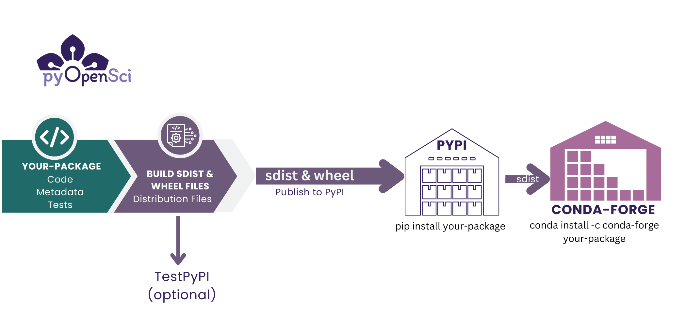

---
jupytext:
  text_representation:
    extension: .md
    format_name: myst
    format_version: 0.13
    jupytext_version: 1.16.4
kernelspec:
  display_name: Python 3 (ipykernel)
  language: python
  name: python3
---

+++ {"editable": true, "slideshow": {"slide_type": ""}}

(share-your-code)=
# Share Your Code

Sharing your code online using [open licenses](https://www.pyopensci.org/python-package-guide/documentation/repository-files/license-files.html) is a powerful way to make your work more open and collaborative, supporting the principles of open science. By openly sharing your code, you can set clear guidelines on how others can use, modify, and distribute it through licensing, ensuring that your contributions are respected.

When your code is hosted on a shared platform, others can easily download, install, and use it, making it more accessible and useful to the broader community. Additionally, you can set up proper citations for your code, giving contributors and yourself credit for the work and promoting transparency. [Learn more about setting up citation in our lesson on citing code.](cite-your-code)

### Different ways to share code 

There are several ways to share code. 
1. You can post your code to an online repository like GitHub or GitLab.
2. You can publish your code in a journal such as the Journal of Open Source Software
3. You can publish your code to a repository of open source packages such as [PyPI](pypi) and/or [conda-forge](conda-forge).

In this lesson, you will learn about using the version control platform, GitHub, to share your code. GitHub supports version control and provides collaborative features that help you manage contributions, track changes, and engage with the community.

## Share your code using GitHub or GitLab

[GitHub](https://github.com/) and [GitLab](https://gitlab.com/) are both online verion control and collaboration platforms. These platforms allow you to:

- **Make your code open:** By hosting your project on these platforms, you can make it publicly accessible for others to view and contribute.
- **Enable collaboration:** GitHub and GitLab have tools that enable others to review your code, suggest changes, and open issues related to bugs or new features.
- **Track and manage changes:** Version control tools, like Git, allow you to track every change made to your code, making it easy to revert mistakes, compare different versions, and keep your work organized.

### Benefits of version control

Version control systems (like Git) are fundamental to collaborative coding. These tools keep a history of changes to your codebase, allowing you to:

- **Work on multiple features simultaneously:** Use branches to work on new features or bug fixes without disrupting the main codebase.
- **Collaborate effectively:** Multiple contributors can work on the same project without conflicts, thanks to the ability to merge changes from different branches.
- **Identify and fix bugs quickly:** If something goes wrong, you can use the history to identify the change that introduced a bug and revert it if necessary.

Using hosting platforms like GitHub and GitLab helps you manage your code and provides a welcoming environment for contributors to get involved and contribute back to your project.

(install-github)=
## Install software directly from GitHub

Once you have turned your code into a Python package and shared it on GitHub, multiple ways exist to make it directly installable. One simple approach is to install your package directly from GitHub using `pip`.

:::{admonition} `pip install` doesn't have to mean PyPI! 
:class: tip

Many people associated `pip` with PyPI. `pip` is a package management tool that operates independently from PyPI. However, if you run `pip install package name,` `pip` defaults to looking for a package on PyPI. 

It's important to remember that a `pip`-installable package does not necessarily need to live on PyPI. You can install packages using pip from many sources, including locally, from GitHub, and from PyPI. 
:::

### Steps to Install Code from GitHub

1. **Upload Your Code to GitHub:** 
   Start by pushing your package to a public repository on GitHub or GitLab. Ensure that your repository includes a `setup.py` file or a `pyproject.toml` file configured to describe your package and its dependencies. 

2. **Install the Package Using pip:** 
   You can install any public GitHub-hosted package directly using a command in the following format:

```bash
pip install git+https://github.com/pyopensci/pyospackage.git
```

The command above tells `pip` to download and install the package from the specified GitHub repository. It pulls the code from the repository, builds it if needed, and installs it in your current Python environment.

### Install a package from a specific repository

If you have cloned or forked a repository and made modifications to the code, you can also install your version by replacing the username in the URL with your GitHub username. 

For example:

`pip install git+https://github.com/pyopensci/pyospackage.git`

The above will be installed from the pyOpenSci-owned repository. To install from your account and form of the repository, use:

`pip install git+https://github.com/YOUR-GITHUB-USERNAME-HERE/pyospackage.git`

## Benefits of direct GitHub installation

Directly installing from GitHub is beneficial because it allows others to quickly access and test the latest versions of your code without waiting for an official release. This is particularly useful during active development phases or when you want to share experimental features with collaborators.

Remember that the `git+` prefix in the URL tells pip to use Git to fetch the repository. This works for any public repository, making it a flexible and easy way to distribute your code.

## Publish and install software from PyPI

Above, you learned how to share your code on GitHub and install it directly using `pip`.

Another option is to [publish your package to PyPI](https://www.pyopensci.org/python-package-guide/tutorials/publish-pypi.html)—the Python Packaging Index.


:::{figure-md} pypi-conda-publication



The Python package software publishing workflow from GitHub to PyPI and conda-forge. [Learn how to creat a Python package, here.](https://www.pyopensci.org/python-package-guide/tutorials)
:::

### What is PyPI?

The **Python Package Index (PyPI)** is the official repository for Python packages. It’s a community-supported platform where you can upload, share, and distribute Python packages with the broader Python community. Publishing your package to PyPI makes it easier for other users to find, install, and use your code. However, in order to publish to PyPI, you first need to [create a Python package.](https://www.pyopensci.org/python-package-guide/tutorials/intro.html)

### Why publish to PyPI?

- **Easily share your package**: PyPI allows anyone to install your package using a simple command like `pip install your-package-name`. This makes it easy to distribute your code to users around the world.
- **Centralized and trusted**: As the official repository, PyPI is a trusted source for Python packages. Publishing your package there signals to others that your code is available and maintained in a standardized way.
- **Community support**: PyPI is supported by the Python community, which means there are established guidelines, standards, and tools for creating and managing packages. Publishing to PyPI allows you to contribute back to the community and help others benefit from your work.

:::{tip} Check Package Name Availability

Before publishing, you must check that the name you want for your package is available. PyPI requires that each package name be unique. You can search for your desired package name on [PyPI’s website](https://pypi.org/) to ensure it’s not already in use.
:::


## Publish and install software from conda-forge

Another popular option for distributing your package is to publish it on the **conda-forge** 
channel of conda. 

### What is conda-forge?

**conda-forge** is a community-led collection of conda packages. It provides a reliable and easy way to distribute Python packages and their dependencies. Unlike PyPI, which uses `pip`, conda-forge uses the `conda` package manager, which is popular in scientific computing due to its ability to manage complex dependencies and non-Python packages.

You can learn more about [how to publish to conda-forge in our Python Packaging Guide](https://www.pyopensci.org/python-package-guide/tutorials/publish-conda-forge.html).


## Cite your code  

Even if you haven't published your code in an academic Journal, you can create a DOI that allows you to cite it using [Zenodo](zenodo). While you can upload code and other types of documents to Zenodo at any time, if you are using GitHub, you can create a direct connection to Zenodo, which will not only provide a DOI for the GitHub repository but also allow you to create new sub-DOIs for every new version of your code that you make.


:::{figure} ../images/zenodo-github-connect.svg
---
alt: "alt here."
name: zenodo-github-connect
width: 700px
---

Here is a caption
:::

(open-license)=
## Use an open license 

[Open licenses](https://www.pyopensci.org/python-package-guide/documentation/repository-files/license-files.html) ensure that others can freely use and build upon your code while crediting you and anyone else who developed it. Sharing code online creates a collaborative and open environment where everyone benefits, leading to better software, more reproducible research, and a stronger sense of community.

:::{tip}
In fact, the lessons you are reading now are the product of a highly collaborative lesson development workflow that pyOpenSci leads! These lessons are infinitely more accurate, better, and more comprehensive because of the numerous contributions that community members with a broad range of expertise make.
:::
